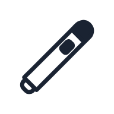
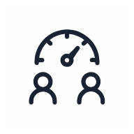
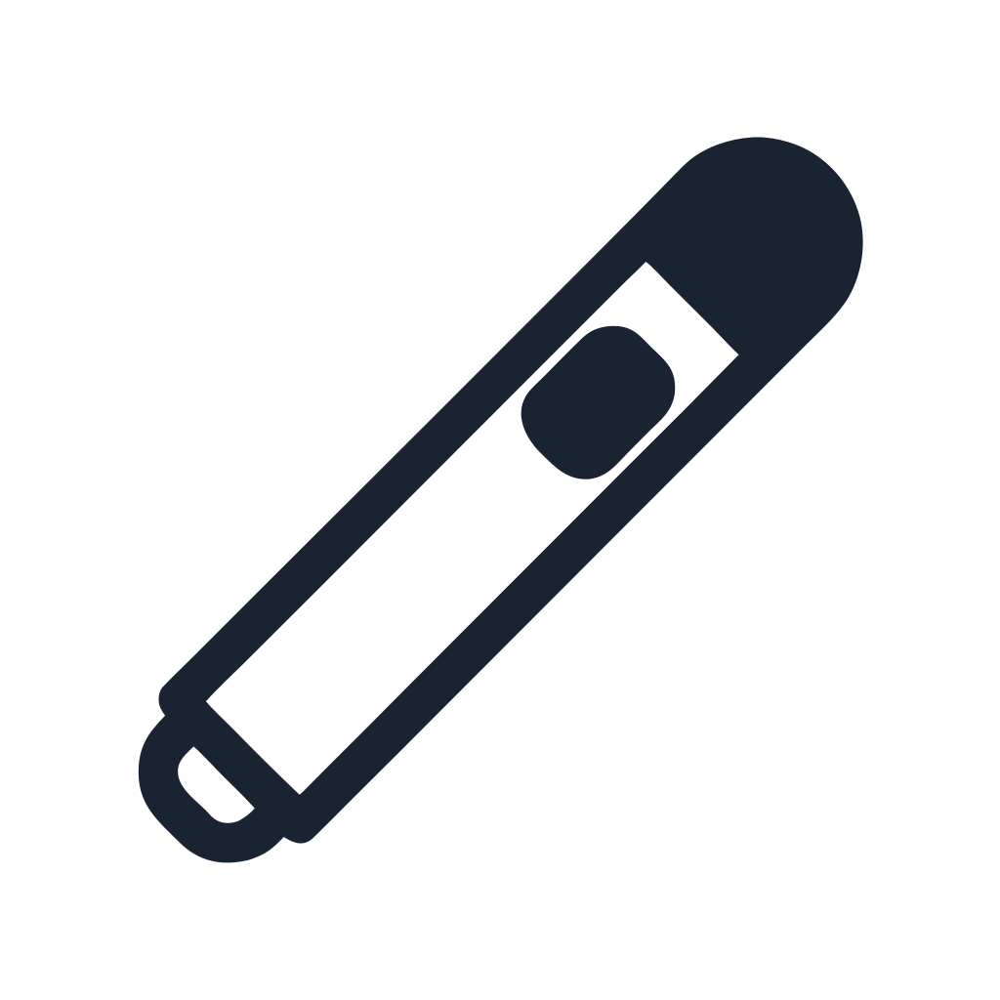

# 45 Presentation Icons — SVG Pack for PowerPoint & Keynote

> 45 presentation icons in 4 color variants. Enhance presentations with slide deck icons, speaker visuals, and feedback icons. $4.99 for 180 SVGs.

## 4 free icons + 41 more in the full pack

This repository contains **4 free preview icons** from the 45-icon pack.
Use these freely in any project. No attribution required.

### Get the full 45-icon pack

- **$4.99** on Gumroad: [https://ecomgendesign.gumroad.com/l/presentation-icons](https://ecomgendesign.gumroad.com/l/presentation-icons)
- **Live preview:** [https://e-comgen.site/packs/presentation-icons](https://e-comgen.site/packs/presentation-icons)

## Free icons in this repo

| Icon | File |
|---|---|
|  | [`preview/laser-pointer-with-clicker.svg`](preview/laser-pointer-with-clicker.svg) |
|  | [`preview/audience-engagement-meter.svg`](preview/audience-engagement-meter.svg) |
|  | [`preview/presentation-timer.svg`](preview/presentation-timer.svg) |
|  | [`preview/feedback-form.svg`](preview/feedback-form.svg) |

## How to use

**HTML / CSS:**
```html

```

**Figma / Sketch / Adobe XD:**
Drag-drop SVG into your design tool. Becomes editable vector.

**React:**
```jsx
import { ReactComponent as Icon } from './preview/laser-pointer-with-clicker.svg';
<Icon className="w-6 h-6" />
```

## License

Free icons in this repo: **MIT License** — use freely.
Full pack (45 icons): commercial license, no attribution. See full pack on Gumroad.

---

Made by [e-ComGen Design](https://e-comgen.site) — SVG asset packs for designers and developers.